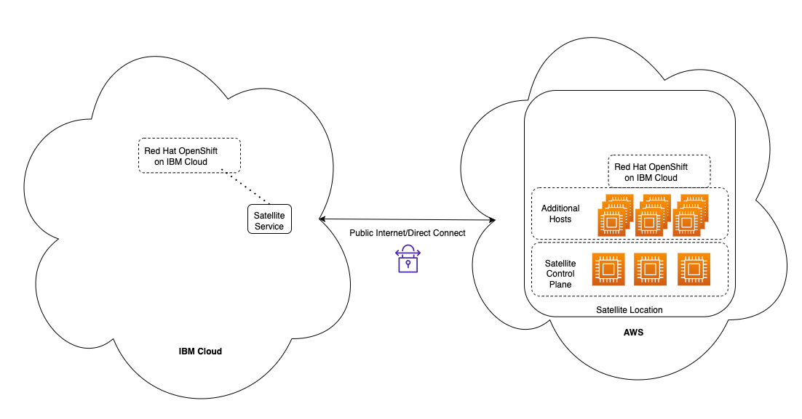

!!! Warning "This section needs to be re-written. Some links are broken. Left here for informational purposes."


The information is specific to the custom <a href="https://techzone.ibm.com/collection/se-l3-ibm-cloud-satellite" target="_blank">{{ learningplan.name }}</a> TechZone environment. You will want to create a similar document for any new environments in the event it needs to be rebuilt. Given my experience with TechZone, this will most likely happen as I was forced to rebuild 3 times for various reasons.

The TechZone environment created for this L3 is a **shared/multi-tenant** environment. In other words, instead of like other infrastructure TechZone environments where each user gets their own instances of resources, here a common set of cloud resources are shared by all users. The common resources need to be appropriately protected so users cannot cause damage to the shared resources. This is typically done by only granting the users the IBM Cloud IAM (identify access management) capabilities they require to accomplish their tasks and isolating the environment where they make changes. This is accomplished when TechZone processes the user's reservation for the environment.

It will be your responsibility to define the access roles, policies, and any additional scripted/automated steps that need to be perform when a user is added and removed from the environment (reservation create/delete). As mentioned earlier, a custom environment will need to be requested.  TechZone will assign a developer to assist, but you will need to do most of the work.

The following is the repository used by TechZone for the {{ learningplan.name }}: https://github.ibm.com/dte2-0/ccp-gitops-patterns/tree/main/ibm-satellite-lab. The scripts directory contains the SatLab-TZ-AddUser.sh and SatLab-TZ-DeleteUser.sh scripts I wrote. The IAM roles and policies are defined in main.tf. For this environment, we use a common access group (**satellite-user**), and then create a group for each user's reservation that further restricts their access to the Satellite configuration and OpenShift projects (namespaces).

The following are the high level steps of what occurs when a reservation is started:

- Add user to the account (sends invite that the user must accept)
- Use the user's IBMID as a unique name instead of email address to create:
  - Satellite configuration using that IBMID
  - Satellite version that will create a project in an OpenShift cluster
  - Satellite subscription that will use the above version to create the project in all OpenShift cluster groups

The following are the high level steps of what occurs when a reservation expires:

- Remove any and all Satellite subscriptions in the users unique Satellite configuration
- Remove any and all Satellite versions in the users unique Satellite configuration
- Remove the users unique Satellite configuration
- Remove the users unique IAM access groups
- Remove the user from the account

The share infrastructure is illustrated in the diagram below.



This environment was created using the IBM Cloud portal. At this point I have not created scripts to automate this process as it should only have to be done once, however, it would be nice to automate and wouldn't be that hard.

The following are the high level steps to create this environment:

- Obtain AWS credentials from TechZone contact
- Create a Satellite Location in AWS using the IBM Cloud Satellite AWS quick start terraform scripts.
  - Location name: aws-us-east-2 (Note: if you change this name, you will need to update the mkdocs.yml for the L3 demonstration script and rebuild (mkdocs gh-deploy) the demonstration script in the GitHub Pages).
  - AWS region: us-east-2
  - 3 control plane hosts
  - 9 additional hosts
  - AWS image configuration used: m5d.2xlarge
  - Managed from location: Washington, DC

The video of the actual creation of the above environment is in Part 1 of the learning plan demonstration script.

Next, the RedHat OpenShift on IBM Cloud (ROKS) clusters need to be created. For this L3, we have a ROKS cluster running in IBM Cloud in Washington, DC and one running in our Satellite location. Each of these are deployed with 9 worker nodes. The video of the actual creation of the above environment is in Part 2 of the learning plan demonstration script. (Note: if you change this names of the clusters, you will need to update the mkdocs.yml for the L3 demonstration script and rebuild (mkdocs gh-deploy) the demonstration script in the GitHub Pages).

Once the ROKS clusters are completely up, running, and available, the ROKS in the AWS Satellite location needs to be configured to use the public IP addresses for the hosts in AWS (by default, they use private IPs.). This requirement is documented in the Satellite product documentation, as well as the other this TechZone collection: <a href="https://techzone.ibm.com/collection/SetupIBMCloudSatelliteLocationInAWS" target="_blank">Setup a IBM Cloud Satellite Location in AWS</a>. I did automate this process with a script.  This script is part of the Satellite L3 repository and can be retrieved using the following command:

```
 wget https://raw.githubusercontent.com/IBM/SalesEnablement-Satellite-L3/main/tools/satelliteSwapIPs.bash
```

 The script is interactive and straight forward to use.

 To get rid of ingress controller warnings on AWS cluster, see: https://cloud.ibm.com/docs/satellite?topic=satellite-ts-degraded-ingress

 The ROKS cluster running in IBM Cloud also needs to be registered with your IBM Cloud Satellite instance. This is done via the IBM Cloud Portal in the Satellite clusters pages.

 Next, the Satellite Cluster Groups need to be created. One group for each of the clusters. Those are used in deploying the cloud native application as well as the versions/subscriptions created on new reservations to add projects (namespaces) to the ROKS clusters. These are:

 food-deliver-production-clusters - IBM ROKS cluster
 food-delivery-development-clusters - AWS ROKS cluster

 (Note: if you change this names of the cluster groups, you will need to update the mkdocs.yml for the L3 demonstration script and rebuild (mkdocs gh-deploy) the demonstration script in the GitHub Pages).

 Finally, you need to test, test, and test again. I've created a couple of scripts that automate the manual steps the users do in Part 3 of the demonstration script. These are stored in the Satellite L3 repository (tools directory) and can be retrieved using the following command:

 ```
  wget https://raw.githubusercontent.com/IBM/SalesEnablement-Satellite-L3/main/tools/deployIBMSatL3.bash
  wget https://raw.githubusercontent.com/IBM/SalesEnablement-Satellite-L3/main/tools/destroyIBMSatL3.bash
 ```
