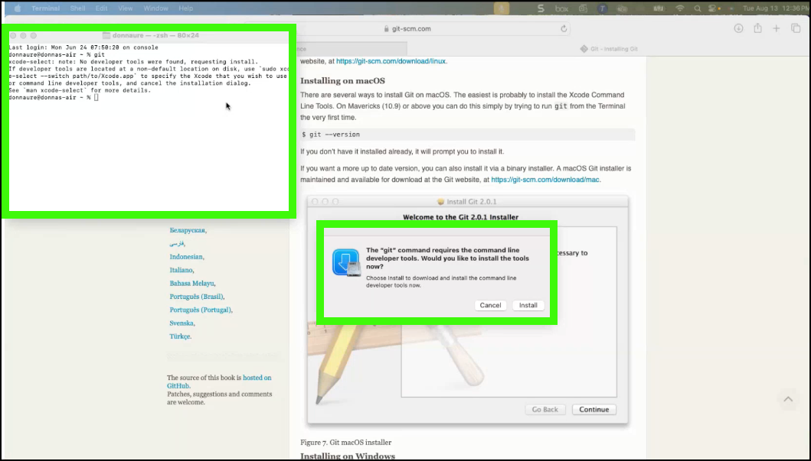

We need to install both **git** and **GitHub Desktop**. 

## git


For MacOS:

1. Open a **terminal** window.
2. Try running the **git** command:

    ```
    git
    ```

3. If it is not already installed, a dialog will pop up to install it along with other developer tools. Follow the directions there to install. It will take a little time, but not the 40 minutes it initially says. If this doesn't occur, follow the directions below for Windows to install.
    
    

For Windows:

1. Open a browser to the following page:

    <a href="https://git-scm.com/book/en/v2/Getting-Started-Installing-Git" target="_blank">https://git-scm.com/book/en/v2/Getting-Started-Installing-Git</a>

2. Scroll down and find the instructions for your platform (Windows or MacOS) and **follow the directions there**.

## GitHub Desktop

1. Using the the appropriate app store for your operating system, install GitHub Desktop. Search for **GitHub Desktop** in the appropriate app store and follow installation directions.

    Mac@IBM application

    <a href="https://w3.ibm.com/download/standardsoftware/PC/lang_en/issiCatalogPC.html" target="_blank">IBM Windows App Store</a>

    
