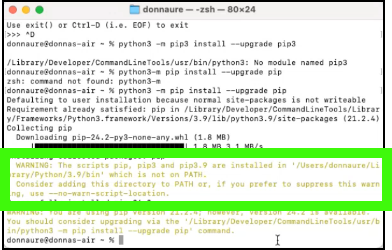

MkDocs is used to build nicely formatted output based upon the GitHub markdown content you will be creating.
As an example, the IBM Cloud Satellite L3 is specified in this <a href="https://github.com/IBM/SalesEnablement-Satellite-L3" target="_blank">GitHub repository</a> and the MKDOCS build output can be found <a href="https://ibm.github.io/SalesEnablement-Satellite-L3/" target="_blank">here</a>.

MkDocs is well documented here: <a href="https://www.mkdocs.org/" target="_blank">https://www.mkdocs.org/</a>.
You can also do google searches on MkDocs for lots of other useful content and primers. 

Before installing MkDocs, we need a few other tools.

## Python

Python is a powerful scripting language. It is used by MkDocs.

### Mac
For Mac users, python may already be installed on your machine.  Open a terminal and type python. If it is not found, instructions can be found in the <a href="https://www.mkdocs.org/user-guide/installation/" target="_blank">MkDocs Installation guide</a> which includes a link on how to install <a href="https://www.python.org/" target="_blank">Python</a>.

### Windows
For MS Windows users, open a command prompt and type in **python**. This should open the MS App store and you can install python from there.

!!! Note "Windows users"
    
    If you are using Windows, some of the commands below may not work. Try using **python -m** like this:
    ```
        python -m pip install mkdocs
        python -m mkdocs
    ```
    For a more permanent solution, you may need to edit your PATH environment variable to include the Scripts directory of your Python installation. Recent versions of Python include a script to do this for you. Navigate to your Python installation directory (for example C:\Python38\), open the Tools, then Scripts folder, and run the win_add2path.py file by double clicking on it. Alternatively, you can download the script and run it (python win_add2path.py).

## Pip

Pip is a python utility for installing python packages. 

Open a Command prompt (Windows) or terminal (MaCOS) to run the following...

To install, follow these steps:

1. Install **pip**:

    ```
    python -m pip install --upgrade pip
    ```
    or
    ```
    python3 -m pip install --upgrade pip
    ```

    **If you receive a message about a newer version being available, follow the directions to upgrade pip.**

2. If during the last step you received a PATH warning, you need to update your default PATH environment variable.

    

    **MacOS**

    Use a text editor to open the **.zprofile** file in your home directory and add the PATH your copied to the PATH environment variable in the file. The video below shows how this is done. Note, the contents of your **.zprofile** may look a little different. Don't change anything other than the PATH variable and make sure you add a trailing colon (**:**).

    

    **Windows**

    To update the PATH environment variable follow these steps:
    
        a. Right-click on the Start Button.
        b. Select “System” from the context menu.
        c. Click “Advanced system settings”
        d. Go to the “Advanced” tab.
        e. Click “Environment Variables…”
        f. Click variable called “Path” and click “Edit…”
        g. Click “New”
        h. Enter or paste the path that appeared in the warning message. It should be similar to "/Users/andrewj/Library/Python/3.9/bin".

3. If you had to perform the last step, close your terminal or command prompt and open a new one in order for the updated PATH to be used.

4. Install **MKDOCS**

    ```
    pip install mkdocs
    ```

    or

    ```
    pip3 install mkdocs
    ```


5. Install MKDOCS **material theme**

    **Material** is the name of the theme we are using in MkDocs.  You can learn more about it <a href="https://squidfunk.github.io/mkdocs-material/" target="_blank">here</a>.

    ```
    pip install mkdocs-material
    ```

    or 

    ```
    pip3 install mkdocs-material
    ```

6. Install MKDOCS macros plugin

    The **macros plugin** for MkDocs provides lots of useful tools that we use in our builds.  You can learn more about it <a href="https://mkdocs-macros-plugin.readthedocs.io/en/latest/" target="_blank">here</a>.

    ```
    pip install mkdocs-macros-plugin
    ```

    or 

    ```
    pip3 install mkdocs-macros-plugin
    ```

7. Install MkDocs video plugin

    The MkDocs **video plugin** is used to embed videos in our documents.  You can learn more about it <a href="https://pypi.org/project/mkdocs-video/" target="_blank">here</a>.

    ```
    pip install mkdocs-video
    ```

    or

    ```
    pip3 install mkdocs-video
    ```

8. Need to see if this works:

    ```
    pip install pymdown-extensions
    ```

    or 

    ```
    pip3 install pymdown-extensions
    ```

Note, there are many more MkDocs <a href="https://github.com/mkdocs/mkdocs/wiki/MkDocs-Themes" target="_blank">themes</a> and <a href="https://github.com/mkdocs/catalog" target="_blank">plugins</a> that you may find useful in your content development.  However, to be consistent with other IBM Cloud L3s, I suggest sticking with the Material plugin that you just installed.
