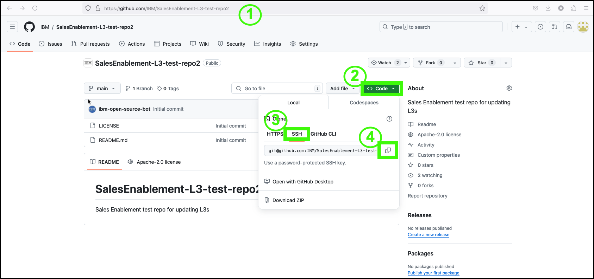
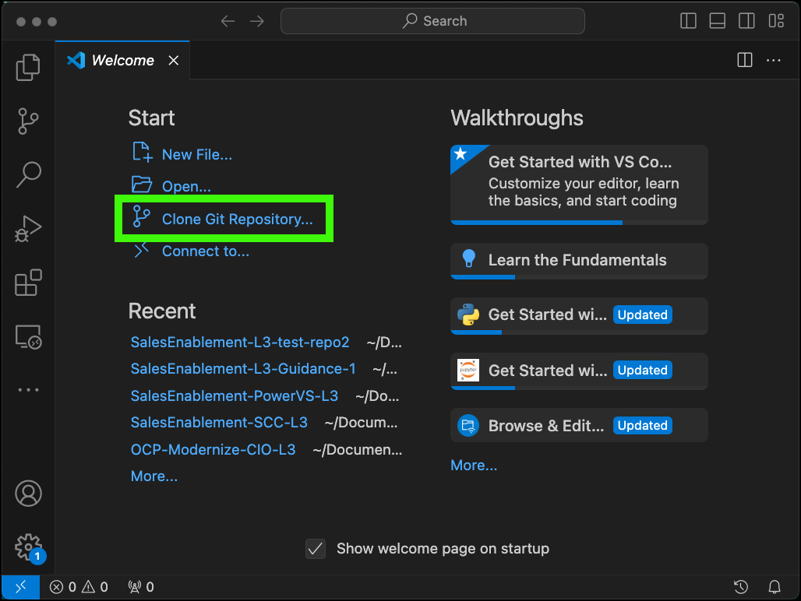
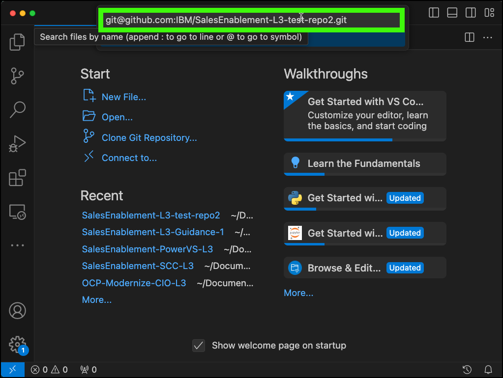
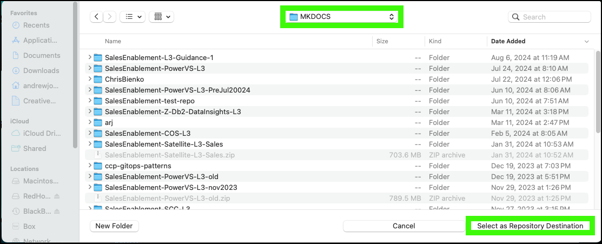

We will be using Visual Code Studio (VSC) to do most your work, however, there will be times when you will need to use a web browser to access the github repository (especially if creating a new course). I'll note when something doesn't have to be done if your just updating a course.

## Clone the repository to your local machine

You can use the new repository you created earlier if you are creating a new course, use and existing L3 repository, or you can play with this test repository: <a href="https://github.com/IBM/SalesEnablement-L3-test-repo2" target="_blank">https://github.com/IBM/SalesEnablement-L3-test-repo2</a>.

1. Open the repository in your browser.
2. Click the green **Code** drop down.
3. Click the **SSH** tab under **Clone**. 
4. Copy the SSH clone link.

5. Open VSC.
6. At the VSC welcome screen, click **Clone Git Repository**.

7. Paste the SSH clone link for the repository in to the entry field and **Enter**.

8. Specify where you want to save your clone on your local machine and then click **Select as Repository Destination**.

!!! Note "Where should I save this?"

    It really doesn't matter, but I would suggest creating a directory where you will keep all your Sales Enablement L3s. Perhaps something like **~/Documents/SalesEnablementL3s/**. When you specify the directory, it will create a subdirectory with the name of the repository.

9. Click either **Open** or **Open in New Window** on the pop-up dialog.

You now have successfully clone the repository form GitHub to your local machine.

