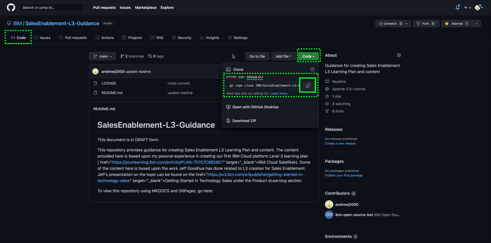

First, you need to create a local copy of your IBM GitRepostory.

1. Open a terminal on your Mac.
2. Create a working directory for your repositories.

I chose ~/Documents/MKDOCS. Probably not the most logical choice. Ssince that is where mine is any screen images I put in here will show that.

```
mkdir ~/Documents/MKDOCS
```

3. Change direcory to the directory you just created.

```
cd ~/Documents/MKDOCS
```

4. Copy the **git clone** command for your IBM GitHub repository.



5. Paste and execute the **git clone** command for your IBM GitHub repository in your terminal.

!!! example
    andrewjones@MacBook-Pro-2 MKDOCS % gh repo clone IBM/SalesEnablement-L3-Guidance
    Cloning into 'SalesEnablement-L3-Guidance'...
    remote: Enumerating objects: 4, done.
    remote: Counting objects: 100% (4/4), done.
    remote: Compressing objects: 100% (4/4), done.
    remote: Total 4 (delta 0), reused 0 (delta 0), pack-reused 0
    Unpacking objects: 100% (4/4), done.

    
