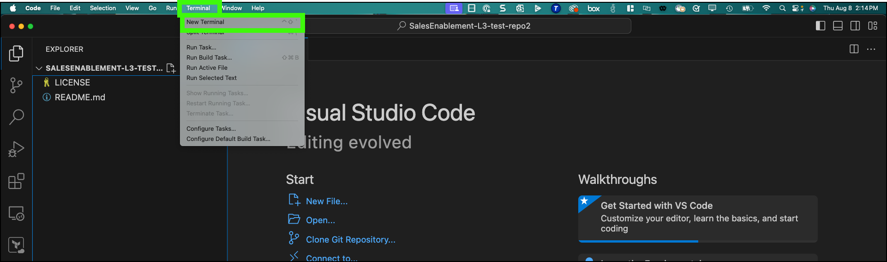
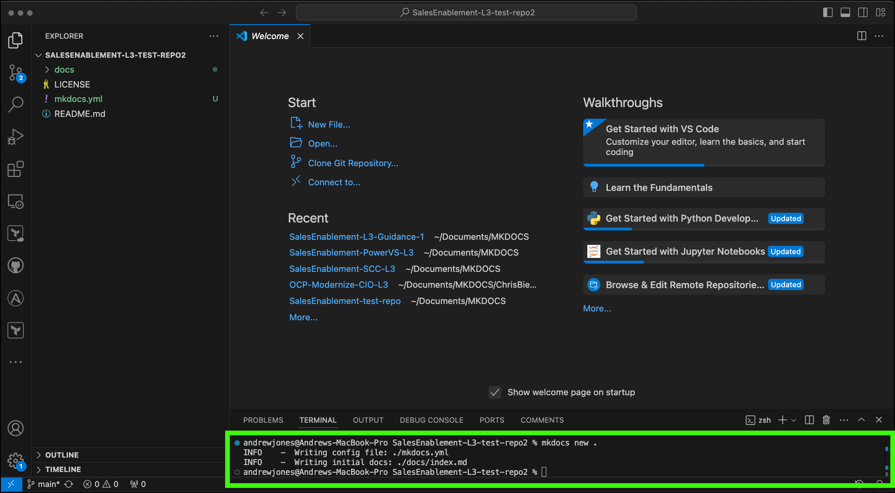
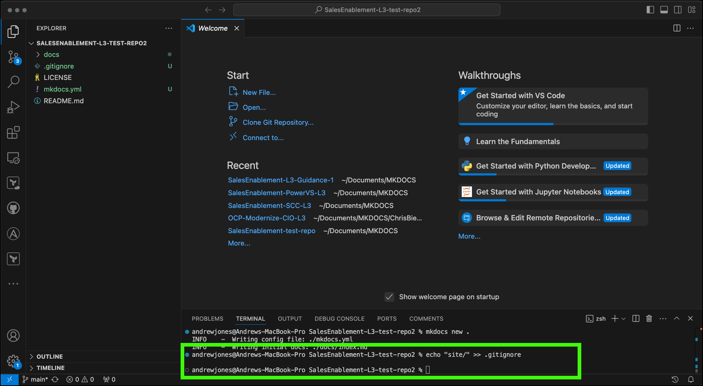

Now that you have a clone of the repository, next you need to initialize MkDocs for the repository. **These steps only need to be completed if you are creating a new L3 and working with a brand new repository. If you are modifying an existing L3 or playing with the test repository, you will not need to do these steps.**

## Initializing a new repository for MkDocs

1. Open a **terminal** in VSC.
   


You can resize the terminal window by grabbing the frame bar between the welcome screen and the terminal. Notice the terminal opens with the path set to the directory that was created for your clone repository.

2. Run the **mkdocs new** command specifying the current directory (.) for the name.

```
mkdocs new .
```



Notice 2 new files and the **docs** directory are created.

3. In the VCS terminal, create a **.gitignore** file to ignore file. 

```
echo "site/" >> .gitignore
```

The .gitignore is used to exclude certain files or directories from being pushed up to the GitHub repository. The above command created the file and populated with the **site** directory. The **site** directory will contain build files that MkDocs generates. These files do not need to be pushed up to GitHub.



