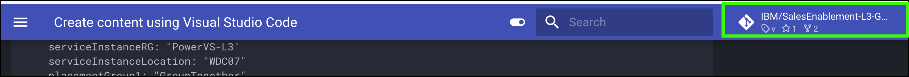

You are ready to start creating content. The structure of a published MkDocs repository is controlled by the **mkdocs.yml** file. 

!!! Important "Do you know YAML?"

    If you are not familiar with Yet Another Markup Language (YAML), that is OK. You can learn more by doing google searches if you want. But one very critical things... YAML has very strict formatting rules. Incorrect use of quotes, colons, and dashes or not lining sections up will result in errors.

## The mkdocs.yml file

For this example we will keep it real simple. The **mkdocs.yml** file that is created with the **mkdocs new** command in the previous chapter is very basic. If you are creating a new L3, I suggest copying the **mkdocs.yml** from an existing IBM Cloud level 3 course and modifying it. This is what was done for the SalesEnablement-L3-test-repo2 repository.

You should spend some time studying the file and its structure. The sections used in the IBM Cloud L3s are described at a high level below. The samples given are based on the SalesEnablement-L3-test-repo2 repository when I initially created it. Others may have modified since, so what you see now in the repository may differ.

1. In VSC, click the **mkdocs.yml** file in the **EXPLORER* view.

    As you modify your **mkdocs.yml** file and add content in your **docs** directory, you will notice on the left hand side of **Visual Studio Code** that a count of the **Unstaged Changes** appear on the **Source Control** icon.  

    While listed as steps below, you don't have to do anything here, but you should go through each step and learn about the different sections used by other IBM Cloud L3s. There are many other configurations that could be specified, but using these will keep things consistent with other IBM Cloud L3s.

2. **Project info**

    This section has general information about the project and who created it, etc. 

    ```
    # Project info
    site_name: IBM Cloud Sample Level 3 
    site_description: IBM Cloud Sample Level 3 
    site_author: Andrew R. Jones (andrewj@us.ibm.com)
    copyright: Copyright &copy; 2024 IBM
    ```

    - **site_name**: shown as the title on the published pages
    - **site_description**: not sure if this is used anywhere
    - **site_author**: not sure if this is used anywhere
    - **copyright**: shown at the bottom of the published pages

3. **Repository**

    This section specifies what GitHub repository is used for the content.

    ```
    # Repository
    repo_name: IBM/SalesEnablement-test-repo2
    #repo_url: https://github.com/IBM/SalesEnablement-L3-test-repo2
    #edit_uri: edit/master/docs
    docs_dir: docs
    ```

    - **repo_name**: the name of the GitHub repository
    - **repo_url**: URL of the repo 
    - **edit_uri**: not sure how this is used
    - **docs_dir**: used to specify subdirectory for all markdown content

    I typically comment out (#) the **repo_url** and **edit_uri**. If you don't, then links to the GitHub repository will appear on the published pages. We may do this in the future to allow users to directly open issues in GitHub.

    

4. **theme**

    The **theme** sections specifies what MkDocs theme to use and attributes for the theme. Recall we installed the **material** theme. There are others, but thus far we have standardized IBM Cloud L3s with the **material** theme. There are also many other attributes that could be specified, but these will suffice for now. You can try changing these and viewing the results, but again, would suggesting keeping these values for consistency with the other L3s.

    ```
    theme:
      name: material
      features:
        - navigation.instant
        - navigation.tracking
        - content.code.annotate
        - content.code.copy
      palette:
        - media: "(prefers-color-scheme: light)"
          scheme: default
          toggle:
            icon: material/toggle-switch-off-outline
            name: Switch to dark mode
        - media: "(prefers-color-scheme: dark)"
          scheme: slate
          toggle:
            icon: material/toggle-switch
            name: Switch to light mode
    ```

5. **plugins**

    The **plugins** sections tells the build process what plugins are used by the content. We installed these plugins already. 

    ```
    plugins:
        - mkdocs-video
        - macros
        - search
    ```
6. **markdown_extensions**

    The **markdown_extensions** also control the look and feel of the published pages.

    ```
    markdown_extensions:
      - sane_lists
      - pymdownx.details
      - admonition
      - pymdownx.highlight:
          anchor_linenums: true
      - pymdownx.inlinehilite
      - pymdownx.snippets
      - pymdownx.superfences
      - pymdownx.keys
      - attr_list
      - md_in_html
    ```

7. **nav**

    The **nav** (short for navigation) section defines the table of content for the published pages and specifies where the content comes from (file names).

    ```
    nav:
      - Introduction: 'index.md'
      - Part 1 - Overview:
        - 'Introduction': 'Part 1/01 Introduction.md'
        - 'Reserve the environment': 'Part 1/02 Reserve.md'
      - Part 2 - Provisioning a PowerVS workspace:
        - 'Introduction': 'Part 2/01 Introduction.md'
       - 'Click through demonstration of a workspace being provisioned': 'Part 2/03 Clickthru-service.md'
      - Part 3 - Next steps:
        - 'Next steps': 'Part 3/01 Next steps.md'
    ```

    The above structure is what I've used in the other IBM Cloud L3s. Using the directory structure and file naming convention keeps the VSC EXPLORER view consistent with the table of contents.

7. **extra**

    Think of the **extra** section as where you can define global variables to be used in your content. Instead of typing the same name in 10 different markdown files, just specify it once here and then reference it in the 10 files using the \{\{variable\}\} notation. You will see this in action when we start editing markdown.

    I don't recall what the **generator: false** extra does.

Again, lots of other things could go in the mkdocs.yml file, but this is what you need to know to work with the existing IBM Cloud L3s.