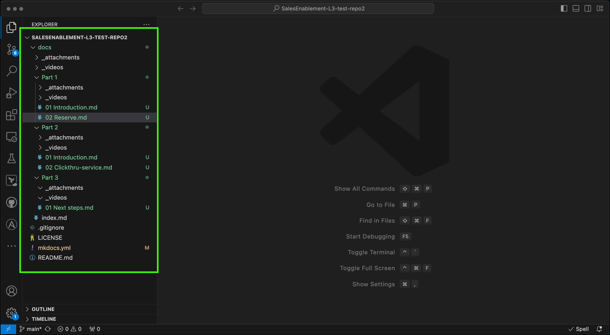

The next step is to start creating or modifying content. The content is created using GitHub markdown language. There are lots of tutorials available on it as well as what is in MkDocs' documentation, specifically the <a href="https://www.mkdocs.org/user-guide/writing-your-docs/" target="_blank">**Writing your docs**</a> section. 

### Creating new content

1. Right click on **docs** in VSC's EXPLORER view and select **New File** or **New Folder**. 

   !!! Important "Create and use the **nav** structure"

       Remember you must use the table of content structure defined in the **nav** section of mkdocs.yml. It doesn't matter which you create first, but they must be in sync when before building the final output (this comes later).

MkDocs supports embedded images, videos, and probably other multimedia. Current IBM Cloud L3s have images and videos. With in each subdirectory created in the **docs** directory, create a **_attachments** and **_videos** directory for the content you will be using. Note, you can do this once and then in VSC do a copy and paste of the empty directories.

No step by step directions for creating content. Look at the sample docs or an existing L3 to learn how. Make sure you follow all the Sales Enablement content standards just as if it was a PPT or Word document. Things like grammar, spelling, consistent spacing and alignment, and the like needs to be followed.

In these samples you will see how to include images, videos, links to other web sites, and common elements in L3s that align with our Center of Excellence guidelines.

Recall from the **nav** section that the first page of the published output is the **index.md** file. The **mkdocs new** command created that file along with the **mkdocs.yml** file. This file will be your course introduction and the first page that users see.

### Saving documents

As you save documents in VSC, only your local repository is being updated at this time. You will notice a number appear next to the **Source Control** icon in VSC. Learn how to **push** your changes to the master GitHub repository and how to build the MkDocs output in the next chapters.

