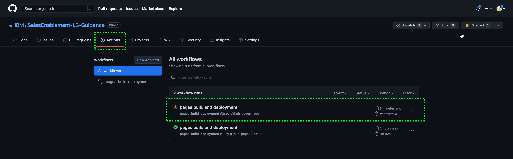
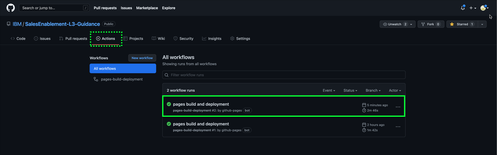
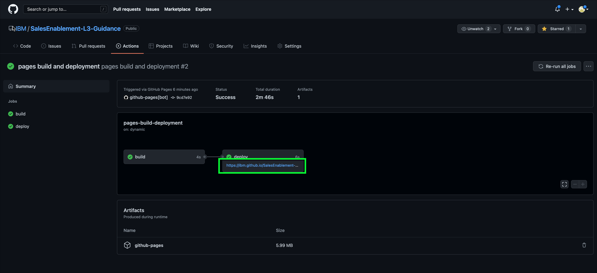

Once these changes are commit, to do the build with MkDocs, follow these steps.

1. Open a **terminal**
2. Change direcotry to your local clone directory

```
cd ~/MKDOCS/SalesEnablement-L3-guidance
```

3. Run **git push**

```
git push
```

!!! example
    Counting objects: 9, done.
    Delta compression using up to 16 threads.
    Compressing objects: 100% (6/6), done.
    Writing objects: 100% (9/9), 776.59 KiB | 13.39 MiB/s, done.
    Total 9 (delta 0), reused 0 (delta 0)
    To https://github.com/IBM/SalesEnablement-L3-Guidance.git
    3e3cf22..b018473  main -> main

You can also do the **git push** from within **Atom** (bottom right after doing a commit).

4. Run **mkdocs gh-deploy**

```
mkdocs gh-deploy
```

!!! example
    INFO     -  [macros] - Macros arguments: {'module_name': 'main',

           'modules': [], 'include_dir': '', 'include_yaml': [],

           'j2_block_start_string': '', 'j2_block_end_string': '',

           'j2_variable_start_string': '', 'j2_variable_end_string': '',

           'verbose': False}

    INFO     -  [macros] - Extra variables (config file): ['learningplan',

           'tz_environment', 'account', 'aws', 'ibm']

    INFO     -  [macros] - Extra filters (module): ['pretty']

    INFO     -  Cleaning site directory

    INFO     -  Building documentation to directory:

           /Users/andrewjones/Documents/MKDOCS/SalesEnablement-L3-Guidance/site

    INFO     -  The following pages exist in the docs directory, but are not

           included in the "nav" configuration:

                            - index.md

    INFO     -  Documentation built in 0.75 seconds

    INFO     -  Copying

           '/Users/andrewjones/Documents/MKDOCS/SalesEnablement-L3-Guidance/site'

           to 'gh-pages' branch and pushing to GitHub.

    Counting objects: 87, done.

    Delta compression using up to 16 threads.

    Compressing objects: 100% (71/71), done.

    Writing objects: 100% (87/87), 3.67 MiB | 1.11 MiB/s, done.

    Total 87 (delta 17), reused 0 (delta 0)

    remote: Resolving deltas: 100% (17/17), done.

    To https://github.com/IBM/SalesEnablement-L3-Guidance.git

    bb3eecb..9cd7e92  gh-pages -> gh-pages

    INFO     -  Your documentation should shortly be available at:

           https://IBM.github.io/SalesEnablement-L3-Guidance/


You will need to carefully review the output of the **mkdocs gh-deploy** command.  If you see **WARNING** these are typically mismatches between files you are trying to include in your mkdocs.yml navigation and the actual file names in the project.

5. Check the status your deployment in **GitHub** web UI.



It may take a few minutes for your build to be scheduled and completed.

6. Verify your deployiment is complete in **GitHub** web UI.



7. Click on the workflow run of your deployment.



8. Click the URL for your deployment and check out your great looking documentation!
