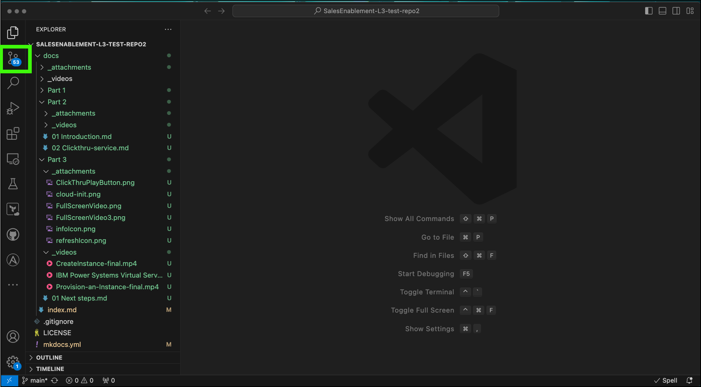
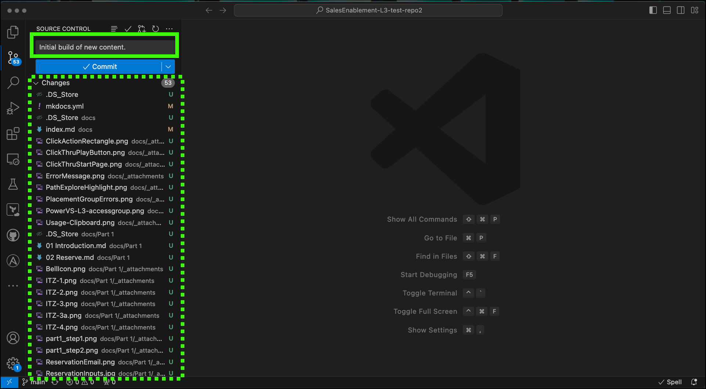
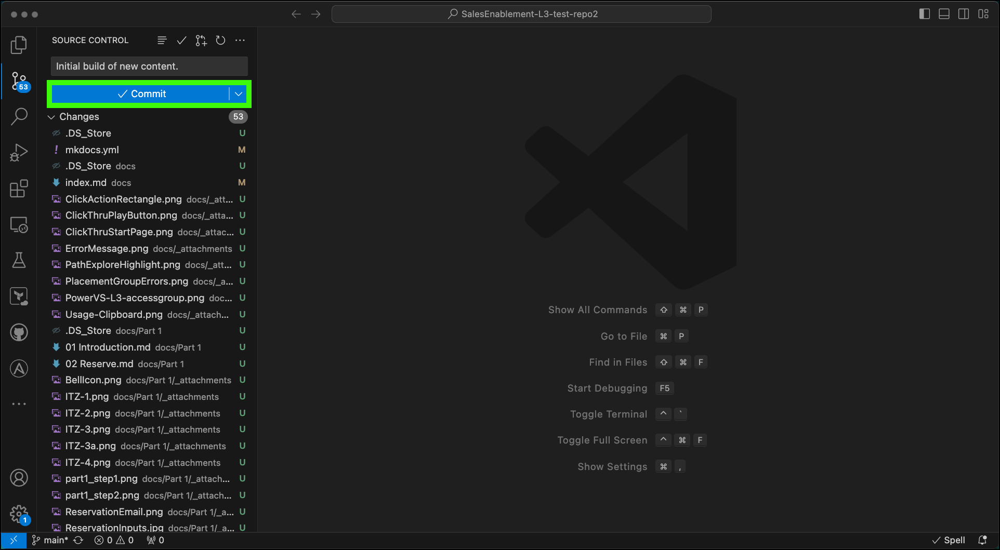
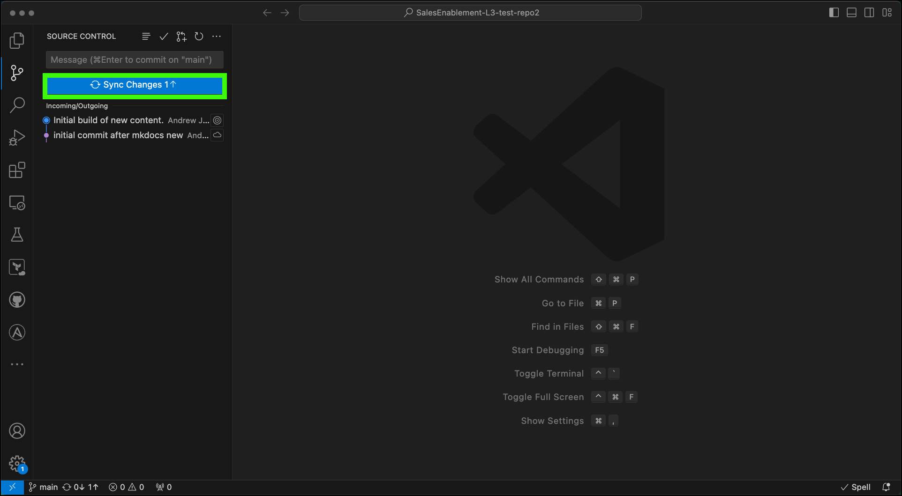

After saving all your open documents in Visual Code Studio (VSC), it is time to commit those changes to the master repository in GitHub. 

Recall, GitHub is all about document management. In a typical software development process you would create a **branch** make modifications there, do your testing, and then **merge** that **branch** into the **master** branch. We should probably do this as well, but there seems to be a limitation with GitHub Pages (which is what we use to serve the final content with). The limitation is that you can only have one Pages site and you can't have a branch site. I get around this when refreshing a course by creating a separate "test" GitHub repository, do my content creation and testing of output there, and then copy all those files to the specific GitHub repository and do a final build there and publish the output. This isn't a big issue for creating new courses or making small "on-the-fly" changes, but it is an issue with doing large refreshes. You don't want to publish parts of a refresh that may affect current users.

Feel free to contact me individually and we can discuss above in detail when the time comes. For now, we will pretend we are creating a new course or just making an "on-the-fly" change.

### Committing your updates

1. Click the **Source Control** icon in VSC.

2. Enter a **message** about what you are committing.

You should try to make this a meaningful message as it will appear as part of the history of the updates in GitHub.

Notice below the **Commit** button are all the files that have been modified, added, or removed.

3. Click **Commit**.

Note, you can perform many commits (thus adding more messages and info in GitHub). This doesn't actually push the files up to GitHub, that comes next.

!!! Note "VSC pop-up dialog"

    If you get a dialog stating something like ***There are no staged changes to commit***, click on **Always**  to always sage your changes and commit them directly.

4. Click **Sync Changes**.

    

    !!! Note "VSC dialog"

        If you get a dialog stating something like ***This action will pull and  push commits from and to origin/main***, click on **OK, Don't Show Again**.

    !!! Note "Connect to GitHub dialog"

        The first time you do this, you may get a GitHub sign in dialog. Use the **Sign in with your browser** button and follow the directions provided which should end with you clicking a **Authorize git-ecosystem** button.

    Note, adding a message here is not required, but a good practice.

    This step will vary in duration based on the number and size of the files that are being sent up to the GitHub repository.

Once everything is committed and synced, you are now ready to use MkDocs to build the **pretty** version of your markdown content and publish it to GitHub pages.