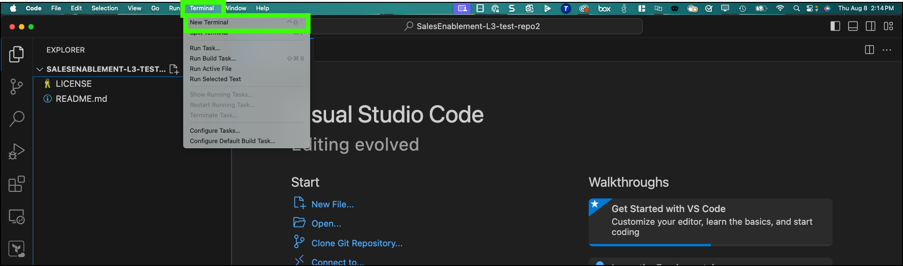

Once these changes are commited, to do the build with MkDocs, follow these steps.

1. If not already open, open a **terminal** in Visual Studio Code.

    

2. Run **mkdocs gh-deploy**

    ```
    mkdocs gh-deploy
    ```

    

If all works properly, as the last line of the output shows, your published pages will be available in a *few minutes* at the URL specified. In the case of **SalesEnablement-L3-test-repo2** the output is published to <a href="https://IBM.github.io/SalesEnablement-L3-test-repo2/" target="_blank">https://IBM.github.io/SalesEnablement-L3-test-repo2/</a>.

The *few minutes* is for the time for the GitHub action to run that finalizes the build and pushes the MkDocs generated HTML to be published to github.io. This is usually pretty quick, but if you do several builds of the same content within a few minutes of each other, the GitHub action requests will get throttled and start to take longer.

### Troubleshooting tips for *mkdocs gh-deploy*

Here are few common messages you may see when *mkdocs gh-deploy* runs. Warnings can usually be ignored, but should probably be addressed.  Errors will need to be resolved before the build will succeed.

- **WARNING -  Version check skipped: No version specified in previous deployment.**: this typically occurs only the first time you run *mkdocs gh-deploy* on a new clone. 

- **WARNING -  Doc file 'Part 1/02 Reserve.md' contains a relative link '_attachments/ITZ-1XXXX.png', but the target 'Part 1/_attachments/ITZ-1XXXX.png' is not found among documentation files.**: probably should be more than a warning, as this will result in a missing image.

- **ERROR   -  Error reading page 'Part 1/Page not used.md': Document is empty**: message is self explanatory. Not sure why it is an error, but the build won't proceed until each file has content.

- **INFO    -  The following pages exist in the docs directory, but are not included in the "nav" configuration: - Part 1/Page not used.md**: message is self explanatory.

Unfortunately, just because the build doesn't show any errors doesn't mean your content is perfect. A few common things you may see in the generated output:

- **no such element: dict object['name']**: if you attempt to reference an **extra** variable from your **mkdocs.yml** file that doesn't exist, you will see text like this in the published document.

    

### View the action status in GitHub

3. Open a browser window to the GitHub repository: <a href="https://github.com/IBM/SalesEnablement-L3-test-repo2" target="_blank">https://github.com/IBM/SalesEnablement-L3-test-repo2</a>.

4. Click **Actions**.

    

5. Click the top most **pages build and deployment** link.

    Note, the status may still show "building".

    

The deployment shows all the steps of the build process. Feel free to explore the information provided. The link the the deployed content is also available.


Information provided on the above pages may be helpful in debugging issues.