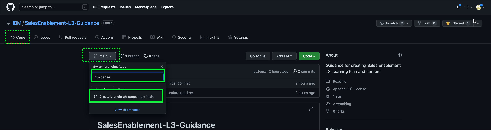
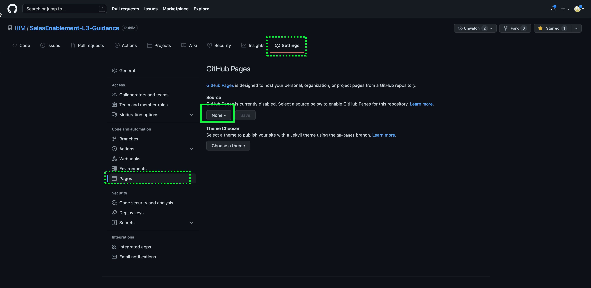
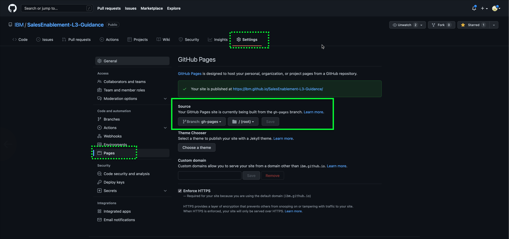
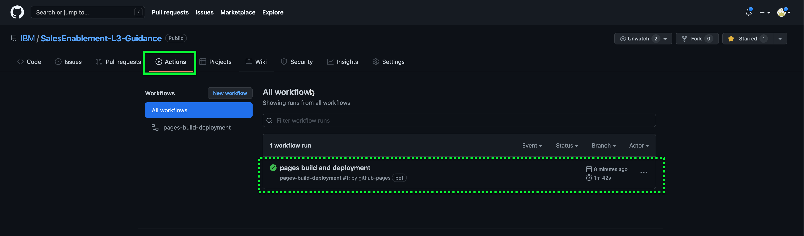

You need to configure GitHub Pages to work with MkDocs.  I needed help with this and ran into a few issues.  I'm not 100% sure if the instructions here are complete, but we can work through it on the next guinea pig.

Once you have your IBM GitHub repository created, follow these instructions:

1. Go to your IBM GitHub repositories
2. Create a new branch called **gh-pages**

3. Go to "Settings->Pages"
4. Change the **Source** Settings to point to the root of your gh-pages branch

Initial screen may look like this:

You need to change the Source settings to look like below. Note, this may happen automatically when you create teh branch in step 2 above.

5. Click the link for your published site.

This will go to a new view of your README.md file that was created with your new IBM GitHub repository.
Note, at this point the output here isn't real "pretty". Don't worry, this will change once we start using MkDocs.

6. Return to your IBM GitHub repository in your browser (browser back button if you didn't open step 5 in a new window/tab).

7. Verify the Pages build completed by viewing the **Actions** tab in your repository.

